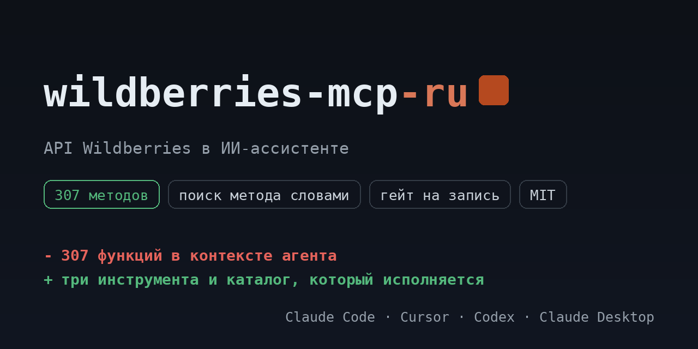

# wildberries-mcp-ru

<!-- mcp-name: io.github.ilyautov/wildberries-mcp-ru -->

API Wildberries для ИИ-ассистентов: продажи и остатки, карточки и характеристики, цены и акции, финансовые отчёты, отзывы. Семнадцать хостов WB разложены по каталогу.

[](https://pypi.org/project/wildberries-mcp-ru/)
[](https://github.com/ilyautov/wildberries-mcp-ru/actions/workflows/ci.yml)
[](LICENSE)
[](#карта-методов)
[](https://marketplaces-mcp-ru.aifrontier.tech/wildberries-api.html)
[](https://github.com/ilyautov/wildberries-mcp-ru/stargazers)

<p align="center">
  <a href="https://marketplaces-mcp-ru.aifrontier.tech/wildberries-api.html">
    
  </a>
</p>

Пакет поднимает один сервер, Wildberries, и ничего больше. Сервер, каталог и
ядро приходят зависимостью из [`marketplaces-mcp-ru`](https://github.com/ilyautov/marketplaces-mcp-ru):
здесь имя, точка входа и документация под один маркетплейс.

## Установка

Первый релиз на PyPI выпускается тегом `v0.5.3`, до этого пакет ставится прямо из репозитория:

```bash
uvx --from git+https://github.com/ilyautov/wildberries-mcp-ru wildberries-mcp-ru
```

После релиза строка короче:

```bash
uvx wildberries-mcp-ru
```

Claude Desktop, `claude_desktop_config.json`:

```json
{
  "mcpServers": {
    "wb": {
      "command": "uvx",
      "args": ["--from", "git+https://github.com/ilyautov/wildberries-mcp-ru", "wildberries-mcp-ru"],
      "env": { "WB_API_TOKEN": "..." }
    }
  }
}
```

Третий путь, если агент умеет скиллы: он поставит сервер и настроит клиент сам.

```bash
npx skills add ilyautov/wildberries-mcp-ru
```

## Ключи

**Где взять токен.** Кабинет `seller.wildberries.ru`, раздел **Настройки**, пункт **Доступ к API**. Токен один на все хосты, но при создании выбираются категории доступа: выданный только под контент токен не пустят в статистику.

**Как он уходит в запрос.** В заголовок `Authorization`, и это важный нюанс: сервер шлёт raw-токен **без префикса** `Bearer`. Подтверждено на практике. Если авторизация падает при верном токене, проверьте это первым.

**Где он лежит.** В `~/.marketplace-mcp/cabinets.json` с правами `chmod 600`, локально. В репозиторий и в чат токен не попадает.

| переменная | секрет | что это |
|---|---|---|
| `WB_API_TOKEN` | да | Токен из кабинета seller.wildberries.ru, Настройки → Доступ к API. Уходит в Authorization без Bearer. |

Ключи можно не держать в окружении: сервер умеет кабинеты и кладёт их в
`~/.marketplace-mcp/cabinets.json` с правами 600, вне репозитория. Магазинов
подключается сколько нужно, переключение прямо из чата.

## Карта методов

Каталог лежит в зависимости как `wb_mcp/endpoints.yaml`:
**307 методов**, из них 187 на чтение, 108 на запись и 12 необратимых.
Сервер исполняет ровно этот файл, поэтому таблица не может разойтись с кодом.

| хост | методов | что там |
|---|---:|---|
| `marketplace-api.wildberries.ru` | 100 | Сборочные задания и поставки FBS, DBS, DBW, самовывоз |
| `seller-analytics-api.wildberries.ru` | 40 | Аналитика продавца: поисковые запросы, остатки, удержания, платное хранение |
| `content-api.wildberries.ru` | 31 | Карточки товаров, характеристики, категории, медиа, ярлыки |
| `advert-api.wildberries.ru` | 30 | Рекламные кампании, ставки, поисковые кластеры |
| `devapi-digital.wildberries.ru` | 22 | Цифровые товары: контент, предложения, ключи активации |
| `feedbacks-api.wildberries.ru` | 20 | Отзывы, вопросы, закреплённые отзывы |
| `discounts-prices-api.wildberries.ru` | 13 | Цены, скидки, календарь акций |
| `common-api.wildberries.ru` | 10 | Информация о продавце, тарифы, комиссии, новости |
| `supplies-api.wildberries.ru` | 7 | Поставки на склад WB и данные для их формирования |
| `finance-api.wildberries.ru` | 7 | Финансовые отчёты и баланс |
| `statistics-api.wildberries.ru` | 5 | Статистика: продажи, заказы, остатки, отчёт о реализации |
| `user-management-api.wildberries.ru` | 4 | Пользователи продавца и их права |
| `advert-media-api.wildberries.ru` | 4 | Медиа в рекламе и статистика по ним |
| `dp-calendar-api.wildberries.ru` | 4 | Календарь акций и участие в них |
| `buyer-chat-api.wildberries.ru` | 4 | Чат с покупателями |
| `documents-api.wildberries.ru` | 4 | Документы продавца |
| `returns-api.wildberries.ru` | 2 | Возвраты покупателями |

Подробный разбор с параметрами и лимитами: [https://marketplaces-mcp-ru.aifrontier.tech/wildberries-api.html](https://marketplaces-mcp-ru.aifrontier.tech/wildberries-api.html)

## Что спросить в чате

- покажи продажи на WB за неделю
- вытащи финотчёт реализации за прошлый месяц
- что пора дозаказать, посчитай дни покрытия
- какие товары рискуют уйти в out-of-stock

## Частые ошибки

**401 при верном токене.** Две причины по частоте. Первая: WB ждёт raw-токен в `Authorization` без `Bearer`. Вторая: активный кабинет в `~/.marketplace-mcp/cabinets.json` имеет приоритет над переменными окружения и затеняет то, что вы экспортировали.

**404 или пустой ответ на рабочем методе.** Проверьте хост. У WB семнадцать доменов по назначению, и статистика на домене контента не отвечает. Таблица хостов выше.

**429, превышен лимит запросов.** Лимиты у WB заданы поштучно и местами очень жёсткие: у части методов это один запрос в минуту, у отчётов бывает и реже. Лимит привязан к методу, а не к аккаунту целиком, поэтому упереться можно на одном отчёте, пока остальное работает.

## Чем это отличается от marketplaces-mcp-ru

Ничем, кроме состава. `marketplaces-mcp-ru` ставит четыре маркетплейса сразу и держит их
под одним сервером, `wildberries-mcp-ru` ставит один. Код общий: правка в ядре доезжает
сюда обновлением зависимости, а не копированием.

| нужно | пакет |
|---|---|
| только Wildberries | `wildberries-mcp-ru` |
| все четыре маркетплейса | `marketplaces-mcp-ru` |

## Кто это сделал

[Илья Утов](https://github.com/ilyautov), лаборатория
[AI Frontier](https://aifrontier.tech). Как эти инструменты устроены внутри,
пишу в [Telegram](https://t.me/gorilla_under_hood) и
[LinkedIn](https://www.linkedin.com/in/ilyautov).

Рядом стоят [**business-mcp-ru**](https://github.com/ilyautov/business-mcp-ru)
(hh.ru, VK, Диадок, СБИС, Честный знак),
[**moysklad-mcp-ru**](https://github.com/ilyautov/moysklad-mcp-ru) и
[**humanizer-ru**](https://github.com/ilyautov/humanizer-ru).

## Лицензия

MIT, см. [LICENSE](LICENSE).
